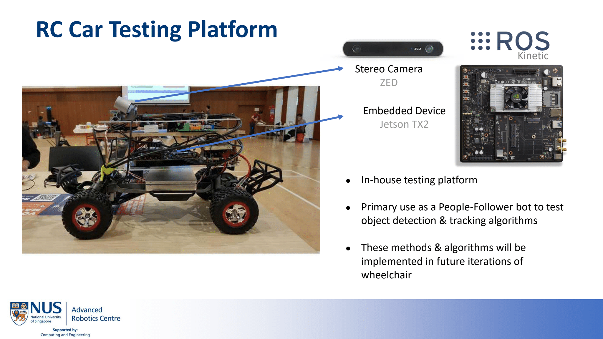

## Autonomous RC Car Platform

**Description**: Inspired by the popular F110 courses, I decided to propose this project to my Undergraduate Supervisor for my undergrad thesis. The goal was to build an RC Car platform from the ground up to have autonomous capabilities. The goal of this platform was to be able to test algorithms and validate them easily without using more expensive hardware in our lab. 

I also developed a people-following algorithm that enables the RC Car to track a person and follow him around through obstacles and occlusions. YOLOv3 was the chosen object detection algorithm and SORT (Simple Online Realtime Tracking) which is basically an extended kalman filter + the hungarian algorithm. This algorithm enabled the wheelchair to track and follow a person as well with a simple PID controller. 

_This project was developed concurrently with the [autonomous wheelchair](../Wheelchair.md)._ 