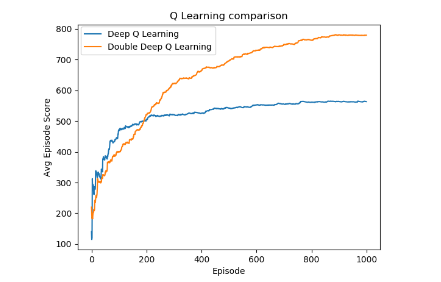

## Deep Q Learning for Atari Ms Pacman 
###### Won best project for CIS520

**Description**: For this project we implemented and compared various Deep Q Learning models. This includes a baseline Q-Learning model, a Deep Q Learning (DQL) Model and a Double Deep Q Learning (DDQL) Model. Our group made use of openai-gym to implement these models. 

We had two main approaches:
    1. Using a CNN to capture the information from the screen of the Ms Pacman game and feeding this latent information into the respective Q Learning Algorithms. (Image Based)
    2. Using the RAM information (provided to us by openai) to use as information to be passed into the respective Q Learning Algorithms. (RAM Based) 

Overall we found the image based method to be superior and found that DQL and DDQL gave vastly superior results. We acheieved the following final results noting that DDQL.

We also had ablation experiments that are further explored in the [report](../report/Final_project_report.pdf). 
