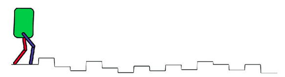

## Planar Bipedal Robot Simulation

**Description**: Simulation of a planar bipedal robot to traverse stochastically varying terrain. For this project, we used MATLAB to simulate the control of two-legged planar bipedal robot. This involved the use of trajectory optimization and feedback control to move the robot. 

The main goal of this project was to allow the root to see a given path and correctly traverse stochastically varying terrain. 

_Image taken from [Dynamic bipedal locomotion over stochastic discrete terrain](https://www.semanticscholar.org/paper/Dynamic-bipedal-locomotion-over-stochastic-discrete-Nguyen-Agrawal/0bf6f1d33847788339b38ed822c0d902d6ba89bc)_