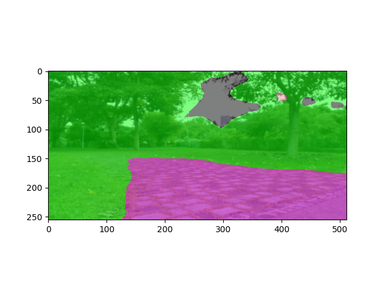
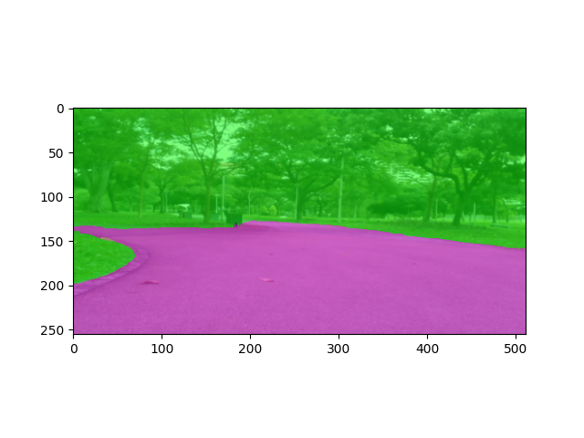
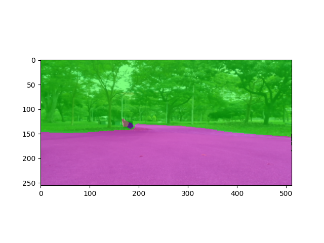
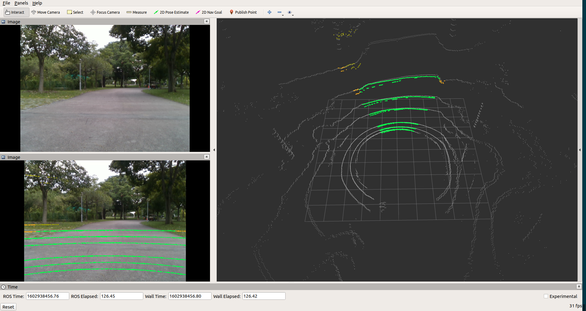

## Semantic Segmentation & Point Painting

**Description:** During my time as a part-time Robotics Engineer at Govtech during the Summer & Fall of 2020, I contributed to the development of the autonomous robot stack (for Boston Dynamic's Spot Robot) at GovTech. This included training deep learning models, developing control algorithms and general software engineering. 

My main contribution was the training & deployment of an outdoor semantic segmentation model to help detect traversable paths and other obstacles/objects. This semantic information was overlapped on a LIDAR pointcloud using geometry which would allow for a propagation of an accurate costmap to help in robot navigation and obstacle avoidance.

**Segmentation**: Various models were trained and experimented with. These include: Deeplabv3, FCN-Resnet and UNet. ([Github Repo](https://github.com/yeshas1994/Semantic-Segmentation)) Since our robot was to be deployed in a park setting, we trained the model on [Cityscapes](https://www.cityscapes-dataset.com/) and finetuned this model on our own park dataset which were labelled by NUS Student Interns. 

 

<!--  -->

Due to our robot being deployed in a realtime situation, we made use of optimization engines like ONNX and TensorRT. These engines allow us to run inference on C++ making our whole framework faster and more compatible since the rest of our robotics stack runs on C++ & ROS. Optimizing the model this way make inference almost double in speed. 

**Point Painting**: After optimization, we proceed to point painting which enables robust and accurate costmap propagation and also allows for proper path traversal, object avoidance and a 3D understanding of the environment. Basically, we use transformations to map the semantic information to the pointclouds which results in below. 

We are currently working on a multi-camera system to allow for a larger field of semantic knowledge and would be more robust than the current single camera system we are using. 