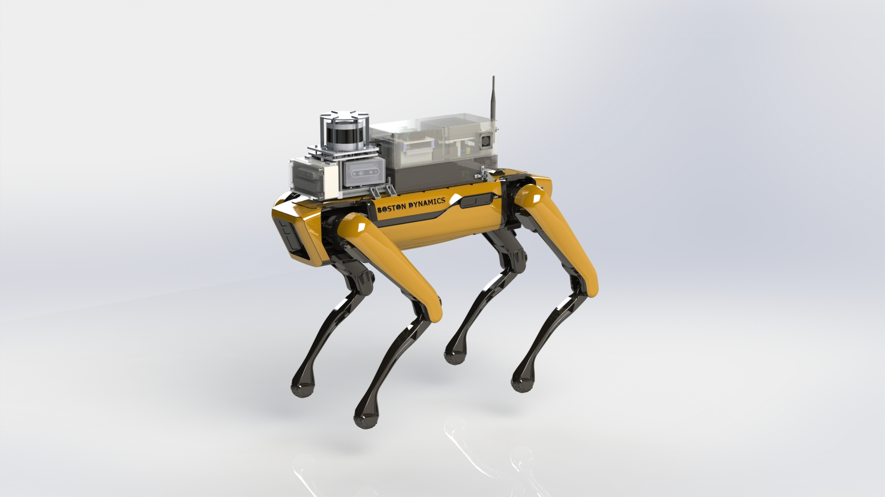

## Payload Design

**Description:** Guided and mentored a group of undergraduate students to fabricate and design a payload for the Spot Robot. This payload is designed to hold multiple cameras, LIDAR, multiple compute and power options. 

