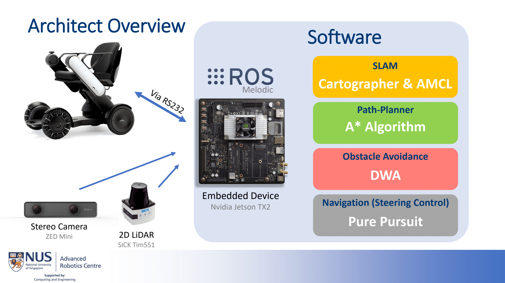

## Autonomous Wheelchair Project

**Description:** The goal of this project was to develop an autonomous wheelchair to act as a tour guide / service for people who are in need of wheelchairs or have difficulties walking. The end goal was to deploy this wheelchair in the National Gallery. 

Wheelchair payload was designed and implemented from the ground-up where we used the Nvidia TX2 for compute. We used Cartographer + AMCL for 2D SLAM, the Dynamic Window Approach for local-planning and A* for global-planning.

#### People Tracking and Following
We also implemented a people detection and tracking algorithm that would allow the wheelchair to track a particular person (say a tour guide) through obstructions and/or occlusions. YOLOv3 was the chosen object detection algorithm and SORT (Simple Online Realtime Tracking) which is basically an extended kalman filter + the hungarian algorithm. This algorithm enabled the wheelchair to track and follow a person as well with a simple PID controller. 

_I also implemented this for my [Final Year Project](Class_Projects/FYP.md)._