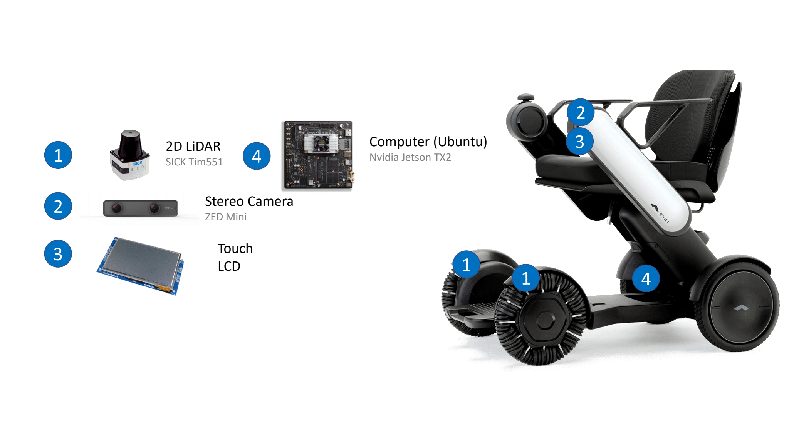

## Work Experience & Projects

#### GovTech (Summer 2020)
- [Semantic Segmentation & Point Painting for Spot Robot](/Govtech.md)
 
- [Model Predictive Controller (Work In Progress)](/MPC.md)

---
#### NUS (Spring + Summer 2019)
- [Autonomous Wheelchair](/Wheelchair.md)

<!-- [Spot Robot Payload Design](/Payload.md)
 -->

---

## Research & Projects
#### UPenn
- [Learning Interactions and Dynamics of Swarms](Class_Projects/cis522.md)
- [Deep RL for Ms Pacman](Class_Projects/deep_rl.md)
- [Planar Bipedal Robot Simulation](Class_Projects/traj_opt)
- [Semantic Edge Detection](Class_Projects/edge_det.md)
- More to be added

#### NUS
- [People-Following RC Car](Class_Projects/FYP.md)

<!-- ###### Ongoing 
- [SOLO]()
- [Mask-RCNN]()
- [VAE & GANs]() -->

--- 
## Courses & Skills
- Programming: C++, CUDA, Python, Java, ROS, 
- Libraries: PyTorch, Onnx, TensorRT, OpenCV, PCL
- Courses: Deep Learning, Learning in Robotics, Model Predictive Control, Optimization and Control in Robotics

---

