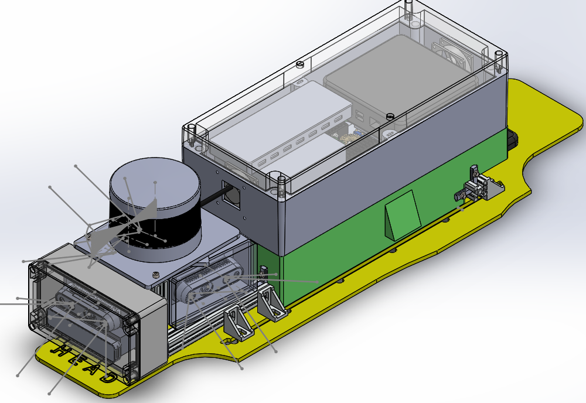

## Work Experience & Projects

#### GovTech (Summer 2020)
##### [Semantic Segmentation & Point Painting for Spot Robot](/Govtech.md)
##### [Model Predictive Controller (Work In Progress)](MPC.md)

---
#### NUS (Spring + Summer 2019)
##### [Autonomous Wheelchair](/Wheelchair.md)
<!-- [Spot Robot Payload Design](/Payload.md)
 -->

---

## Research & Projects

- [Semantic Edge Detection]()
- [Learning Interactions and Dynamics of Swarms](http://example.com/)
- [Deep RL for Ms Pacman](http://example.com/)
- [Planar Bipedal Robot Simulation](http://example.com/)
- [People-Following RC Car](http://example.com/)

###### Ongoing 
- [YOLO]()
- [SOLO]()
- [Mask-RCNN]()
- [VAE & GANs]()

---
## Courses & Skills
- Programming: C++, CUDA, Python, Java, ROS, 
- Libraries: PyTorch, Onnx, TensorRT, OpenCV, PCL
- Courses: Deep Learning, Learning in Robotics, Model Predictive Control, Optimization and Control in Robotics

---

